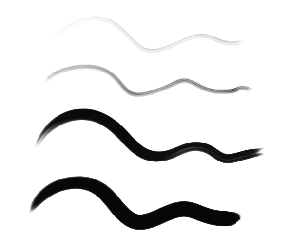
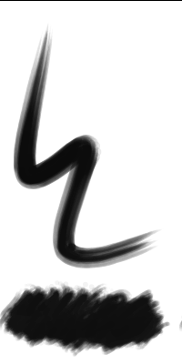

# Brushes
repository for brushes (firealpaca/medibang paint lua brush scripts and krita brush presets)

[(notes on developing FireAlpaca brush scripts)](brushscript_notes.md)

## Dither4.bs / Dither8.bs
it's a brush for ordered dithering effect.\

`Dither4.bs` uses a 4x4 bayer threshold map (16 unique levels), while `Dither8.bs` uses the 8x8 threshold map (64 levels)

allows pressure input, but... only uses the builtin raw pressure input. (probably need to port the elaborate pressure settings?)

### usage notes
(todo)

## Sumi-WithPressure.bs
this is a modified version of a calligraphy-type brush from medi.
the original brush is clever in that it saves a list of points and then redraws the stroke,
as a post-processing step, to get a very specific thinning effect along the middle of the stroke.

this version uses pen pressure in real time, instead of faking it in post-processing.
the original behavior can be restored by unchecking "Use pressure"
 - very small (1-6) Pressure offsets (i.e. minimum value for the pressure curve) may improve the flavor
 - very small (11-12) Pressure multiplication factors may improve the flavor depending on your natural pressure
 - Pressure smoothing naively averages the last `n` values. small (6-8) values may smooth some jitter. extreme (20+) values may have strange effects.

|||
|-|-|

## PixelSpraypaint.kpp
it's like the spraypaint tool of a certain simple builtin art program.
