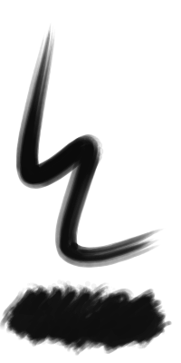

# Brushes
repository for brushes (firealpaca/medibang paint lua brush scripts and krita brush presets)

[(notes on developing FireAlpaca brush scripts)](brushscript_notes.md)

## [DitherLines.bs](DitherLines.bs)
\
horizontal and vertical line 1px patterns with period and phase control (for dithering)

## [Dither4.bs](Dither4.bs) / [Dither8.bs](Dither8.bs)
it's a brush for ordered dithering effect.\
\
`Dither4.bs` uses a 4x4 bayer threshold map (16 unique levels), while `Dither8.bs` uses the 8x8 threshold map (64 levels)

allows pressure input, but... only uses the builtin raw pressure input. (probably need to port the elaborate pressure settings?)

### usage notes
this brush does a lot of heavy pixel plotting that is very inefficient for firealpaca. there isn't really any way around it with the api, so a few warnings:
 - drawing bg color (`use bg`) doubles the per-dab draw workload. it's suggested to instead draw a solid color layer and then the foreground color *without* `use bg`
 - large brush widths (~100+ pixels) will be slow and may lag the program (it has to process 10000 dots per dab individually). to avoid lag, use smaller widths. `full width` mode uses the exact size specified instead of the default width-based-on-pressure behavior.
 - by default, optimization is done to avoid drawing over the same pixels in subsequent dabs, and dab frequency is reduced to every 1-pixel distance. because this may cause slight discrepancies in the edges of strokes, and also changes behavior when using pressure for the threshold, the optimizations can be disabled by checking `accurate(slow)`. this also increases the dab frequency to improve the stroke edge accuracy.

## [Sumi-WithPressure.bs](Sumi-WithPressure.bs)
this is a modified version of a calligraphy-type brush from medi.
the original brush is clever in that it saves a list of points and then redraws the stroke,
as a post-processing step, to get a very specific thinning effect along the middle of the stroke.

this version uses pen pressure in real time, instead of faking it in post-processing.
the original behavior can be restored by unchecking "Use pressure"
 - very small (1-6) Pressure offsets (i.e. minimum value for the pressure curve) may improve the flavor
 - very small (11-12) Pressure multiplication factors may improve the flavor depending on your natural pressure
 - Pressure smoothing naively averages the last `n` values. small (6-8) values may smooth some jitter. extreme (20+) values may have strange effects.

|||
|-|-|

## PixelSpraypaint.kpp
it's like the spraypaint tool of a certain simple builtin art program.
